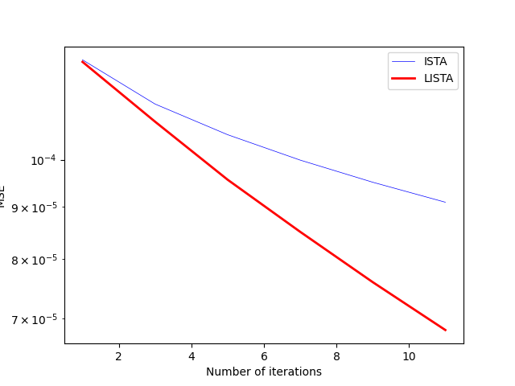
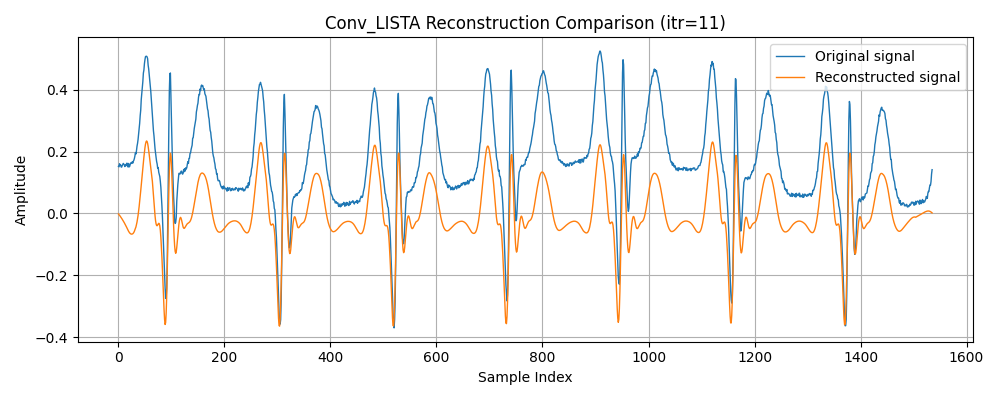

# ECG Denoising with Convolutional Dictionary Learning and ConvLISTA

This project implements an ECG signal reconstruction and denoising pipeline based on convolutional dictionary learning, convolutional ISTA, and convolutional LISTA. The main goal is to learn a compact set of local ECG waveform atoms and use them to reconstruct ECG signals with fewer iterative updates than standard ISTA.

The current version focuses on a convolutional sparse-coding formulation rather than the earlier fully connected dictionary-learning version. The convolutional formulation is better suited for ECG signals because repeated local structures such as QRS complexes, P waves, and T waves can appear at different time positions while sharing similar local morphology.

---

## Project Overview

The pipeline has four main stages:

1. Load and split ECG signal segments.
2. Train a 1D convolutional dictionary using SPORCO.
3. Use convolutional ISTA to generate sparse activation targets.
4. Train a convolutional LISTA model to approximate the ISTA solution with fewer iterations.

The expected signal format is:

```text
s: (B, 1, N)
```

where:

```text
B = number of ECG segments
1 = single ECG channel
N = signal length
```

The convolutional sparse activation map has shape:

```text
X: (B, M, T)
```

where:

```text
M = number of convolutional dictionary atoms
T = N - K + 1
K = atom/filter length
```

The reconstructed signal is obtained by applying the convolutional synthesis operator:

```text
s_recon = A(X)
```

with output shape:

```text
A(X): (B, 1, T + K - 1) = (B, 1, N)
```

---

## Repository Structure

### `starter.py`

Main entry point of the project. It loads the ECG dataset, splits the ECG segments into training and testing groups, trains the convolutional dictionary, converts the SPORCO dictionary into PyTorch format, and runs ConvLISTA training and evaluation.

### `ConvD_dictionary_train.py`

Contains the convolutional dictionary learning code. The dictionary is trained using SPORCO's `ConvBPDNDictLearn` solver. The learned SPORCO dictionary is then converted into PyTorch `Conv1d` format:

```text
D_sporco: (K, 1, 1, M)
D_torch:  (M, 1, K)
```

The current default dictionary settings are:

```text
number of atoms: 16
filter length:   32
lambda:          0.1
main iterations: 5
```

Before dictionary learning, each ECG segment is centered and normalized to reduce the influence of DC offset and scale differences.

### `ConvD_LISTA.py`

Contains the convolutional ISTA and ConvLISTA implementation.

The main components are:

```text
apply_A      : convolutional synthesis operator A(X)
apply_AT     : adjoint analysis operator A.T(y)
estimate_L   : power-iteration estimate of the Lipschitz constant
conv_ista    : convolutional ISTA target generator
LISTA_Model  : learnable convolutional LISTA model
use_conv_lista : full ISTA/LISTA comparison routine
```

---

## Method

### 1. Convolutional Sparse Coding

The ECG signal is represented as a sum of shifted local atoms:

```text
s ≈ A(X)
```

where `D` contains short 1D convolutional atoms and `X` contains the time activation maps.

The sparse coding objective is:

```text
min_X  1/2 ||A(X) - s||_2^2 + rho ||X||_1
```

This formulation encourages the model to reconstruct the signal using a small number of meaningful local activations.

---

### 2. Convolutional ISTA

Convolutional ISTA iteratively updates the sparse activation map:

```text
X <- shrink(X - A.T(A(X) - s) / L, rho / L)
```

where:

```text
L = largest eigenvalue of A.T A
```

In this project, `L` is estimated by power iteration.

ISTA is used as the teacher algorithm. Its output activation map is used as the training target for ConvLISTA.

---

### 3. Convolutional LISTA

ConvLISTA learns a faster update rule inspired by ISTA:

```text
X_next = shrink(We(s) + S(X_prev), theta)
```

where:

```text
We    : learnable Conv1d layer approximating A.T / L
S     : learnable Conv1d layer approximating I - A.T A / L
theta : learnable soft-threshold parameter
```

The two learnable convolutional layers are initialized from the ISTA formula:

```text
We ≈ A.T / L
S  ≈ I - A.T A / L
theta ≈ rho / L
```

This gives the model a stable ISTA-like starting point, while still allowing it to learn faster update behavior during training.

---

## Results

### ISTA vs LISTA Iteration Efficiency

The following figure compares ISTA and ConvLISTA using the same number of iterations/layers. A lower MSE indicates that the estimated sparse activation map is closer to the ISTA target.

<!-- Insert ISTA vs LISTA iteration-speed comparison figure here -->

```markdown

```

**Figure 1.** ConvLISTA reaches a lower activation-map MSE than ISTA at the same small number of iterations, showing that the learned update rule can approximate the ISTA target more efficiently.

---

### ECG Reconstruction Example

The following figure compares the original ECG segment and the reconstructed ECG signal generated from the ConvLISTA activation map.

<!-- Insert ConvLISTA reconstruction comparison figure here -->

```markdown

```

**Figure 2.** The reconstructed signal preserves the major ECG rhythm and QRS-like sharp structures. Smaller and broader waveform components such as P and T waves are partially reconstructed, while DC offset and slow baseline components are reduced by preprocessing and the zero-mean convolutional dictionary.

---

## Current Observations

The current ConvLISTA result preserves the dominant periodic ECG structure and the timing of the main sharp peaks. Compared with an overly sparse reconstruction, the current result also begins to recover smaller waveform components between QRS complexes.

However, the reconstructed signal should be interpreted as an algorithmic reconstruction result, not as a clinically validated ECG signal. The model still needs more systematic validation before it can be considered reliable for medical use.

Current strengths:

```text
- Good preservation of major heartbeat rhythm
- Good preservation of R-peak timing
- Partial preservation of QRS morphology
- Better reconstruction of smaller between-peak structures than the earlier over-sparse version
- Faster approximation of ISTA-like sparse codes using learned LISTA layers
```

Current limitations:

```text
- P and T waves may still be weaker than in the original signal
- ST-segment and baseline morphology are not clinically reliable
- Reconstruction amplitude may be compressed
- The method has not been validated on real clinical ECG datasets
- The current result is not suitable for medical diagnosis or treatment decisions
```

---

## How to Run

Install the required Python packages, including PyTorch, NumPy, Matplotlib, Pandas, and SPORCO.

Then run:

```bash
python starter.py
```

The main script expects the ECG dataset file:

```text
ecg_segments_100x40_6s.csv
```

The dataset is expected to contain ECG segments in the format:

```text
(num_segments, signal_length)
```

In the current implementation, the data is converted into PyTorch format with:

```text
(B, 1, N)
```

before ConvISTA and ConvLISTA are applied.

---

## Notes on Dataset Handling

The full ECG dataset file may be too large to include directly in a GitHub repository. If the dataset is not uploaded, keep the expected filename and shape documented clearly so that users can reproduce the experiment after generating or obtaining the data.

Expected dataset:

```text
ecg_segments_100x40_6s.csv
```

Expected shape:

```text
(4000, 1536)
```

---

## Research Status

This project is currently an engineering and research prototype. It demonstrates that convolutional dictionary learning and ConvLISTA can be used to reconstruct ECG-like signals and accelerate sparse-code inference compared with standard ISTA.

It is not a medical device, not a diagnostic tool, and should not be used for clinical decision-making without extensive validation on real ECG data and appropriate regulatory review.